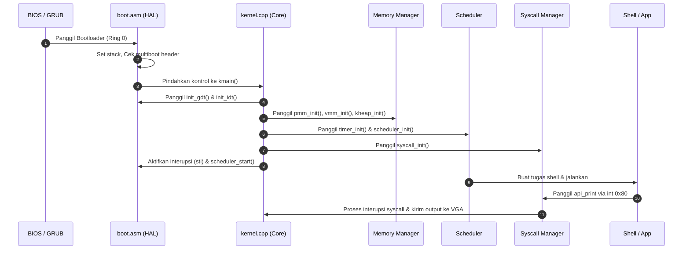

# TrieternalX-OS Architecture

Dokumen ini mendokumentasikan arsitektur sistem TrieternalX-OS secara terperinci, memetakan aliran eksekusi dan pembagian modul dari tingkat terendah (Bootloader) hingga tingkat tertinggi (Applications) berdasarkan struktur hierarki `prompt.txt` dan rancangan berlapis `seperti-ini.txt`.

---

## 📊 Diagram Arsitektur Berlapis

Berikut adalah peta aliran kontrol dan struktur berlapis dari TrieternalX-OS:

```
                  +-----------------------------------+
                  |  Bootloader [SELESAI - VBE Mode]  |
                  |          (GNU GRUB / ASM)         |
                  +-----------------------------------+
                                    |
                                    v
                  +-----------------------------------+
                  |  Hardware Abstraction Layer [OK]  |
                  |          (GDT, IDT, PIC)          |
                  +-----------------------------------+
                                    |
                                    v
                  +-----------------------------------+
                  |       Kernel Core [SELESAI]       |
                  |          (kmain / C++20)          |
                  +-----------------------------------+
                                    |
            ┌───────────────────────┴───────────────────────┐
            |                                               |
            v                                               v
+-----------------------+                       +-----------------------+
| Memory Manager [DONE] |                       | Interrupt Mgr [DONE]  |
|   (PMM, VMM, Heap)    |                       |      (ISR Stubs)      |
+-----------------------+                       +-----------------------+
            |                                               |
            v                                               v
+-----------------------+                       +-----------------------+
|   Scheduler [DONE]    |                       | Drivers [VBE/ATA/PIT] |
|  (Round-Robin, Sleep) |                       |  (VGA, Keyboard, PIT) |
+-----------------------+                       +-----------------------+
            |                                               |
            v                                               v
+-----------------------+                       +-----------------------+
| Filesystem [FAT/VFS]  |                       | GUI Engine [TUI/VBE]  |
|   (FAT16/FAT32/VFS)   |                       |   (TUI Desktop, GUI)  |
+-----------------------+                       +-----------------------+
            |                                               |
            v                                               v
+-----------------------+                       +-----------------------+
|   User API [int 0x80] |                       |  Applications [Shell] |
|      (int 0x80)       |                       |  (Shell, GUI Window)  |
+-----------------------+                       +-----------------------+
```

---

## 🛠️ Pembagian Layer dan Tanggung Jawab

### 1. Bootloader Layer (Ring 0)
- **Tanggung Jawab:** Menerima kendali dari BIOS/UEFI, memvalidasi tanda tanda multiboot, mengaktifkan Protected Mode 32-bit, dan memuat segmen kode kernel C++ ke alamat memori fisik `0x100000` (1 MB).
- **Komponen Utama:** `boot.asm`

### 2. HAL (Hardware Abstraction Layer) (Ring 0)
- **Tanggung Jawab:** Menyediakan abstraksi hardware dasar bagi kernel agar tidak tergantung langsung pada instruksi mesin mentah.
- **Komponen Utama:**
  - **GDT (Global Descriptor Table):** Mengatur segmen memori flat (Ring 0 untuk kernel, Ring 3 untuk user).
  - **IDT (Interrupt Descriptor Table):** Mendaftarkan 256 gerbang interupsi CPU.
  - **PIC (Programmable Interrupt Controller):** Melakukan remap IRQ hardware agar tidak bertabrakan dengan internal CPU Exceptions.

### 3. Kernel Core (Ring 0)
- **Tanggung Jawab:** Mengkoordinasikan siklus hidup booting sistem, memanggil seluruh inisialisasi subsistem secara teratur, dan bertindak sebagai supervisor utama.
- **Komponen Utama:** `kernel.cpp`

### 4. Memory Manager (Ring 0)
- **Tanggung Jawab:** Mengelola ruang alamat fisik dan virtual serta menyediakan fungsi alokasi memori dinamis.
- **Komponen Utama:**
  - **PMM (Physical Memory Manager):** Alokator halaman fisik berbasis bitmap 4 KB.
  - **VMM (Virtual Memory Manager):** Mengatur tabel halaman tingkat satu dan tingkat dua serta memanipulasi pemetaan alamat virtual.
  - **Heap Allocator:** Implementasi best-fit linked list untuk alokasi dinamis ukuran variabel (`kmalloc` / `kfree`).

### 5. Interrupt Manager & Drivers (Ring 0)
- **Tanggung Jawab:** Menangani sinyal interupsi asinkron dari hardware dan menghubungkannya dengan driver perangkat yang sesuai.
- **Komponen Utama:**
  - **PIT Timer Driver:** Menghasilkan ticks periodik 100 Hz pada IRQ 0.
  - **Keyboard Driver:** Driver keyboard PS/2 dengan penerjemah scancode.
  - **VGA Driver:** Driver output layar teks 80x25 berwarna.

### 6. Scheduler & Process Manager (Ring 0)
- **Tanggung Jawab:** Mengelola multitasking preemptive, alokasi thread, serta perpindahan konteks antar tugas secara teratur menggunakan algoritma Round-Robin.
- **Komponen Utama:** `scheduler.cpp`

### 7. Filesystem (Ring 0)
- **Tanggung Jawab:** Menyediakan sistem berkas virtual terstruktur untuk menyimpan konfigurasi dan file log sistem.
- **Komponen Utama:** `fs.cpp` (RAM-based VFS).

### 8. GUI Engine (Ring 0 / Ring 3)
- **Tanggung Jawab:** Menggambar antarmuka Desktop bergaya Windows 95 menggunakan karakter grafis teks TUI, serta mengelola interaksi jendela aplikasi.
- **Komponen Utama:** `gui.cpp`, `api.cpp`.

### 9. User API (Ring 3 Gate)
- **Tanggung Jawab:** Menyediakan pustaka pembungkus system call melalui interupsi software `int 0x80` agar program pengguna dapat memanggil layanan kernel secara terkontrol.
- **Komponen Utama:** `syscall.cpp`, `user_api.cpp`.

### 10. Applications (Ring 3)
- **Tanggung Jawab:** Menjalankan aplikasi pengguna tingkat akhir seperti kernel shell dan simulasi antarmuka Desktop.
- **Komponen Utama:** `shell.cpp`

---

## 🔄 Aliran Eksekusi Sistem (Siklus Hidup)


